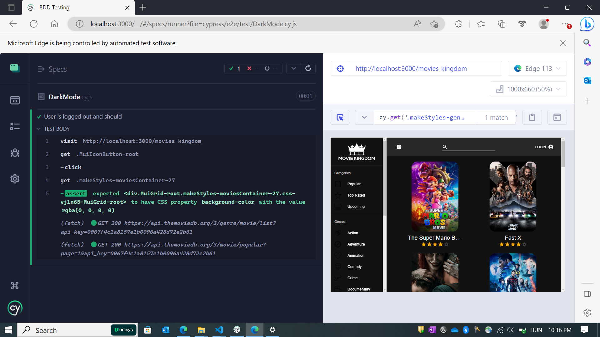

# BDD Testing

## **Project Name: Movies Kingdom**

### **Overview:**

The objective of the work I have done is to perform Behavior-Driven Development (BDD) testing on a React App using the Cypress testing framework. The React webpage is a web application that offers various interactive features and functionalities such as Movie Search, Login, Dark Mode, etc. The testing process aims to validate the behavior and functionality of the application to ensure it meets the desired requirements and delivers a smooth user experience.

### Setup Instructions:

1. Clone the project repository from GitHub.
2. Navigate to the project directory and run the following command to install the project dependencies:
3. Launch the React App locally.
4. run the Cypress test runner using the following command:

```
npx cypress open
```

### **Test Scenarios:**

List the test scenarios or user stories you focused on during testing. This helps provide an overview of the functionality covered.

1. User Login
2. Genre Selection
3. Dark Mode
4. Movie Search

### Test Scenario 1: User Login

**Test Case 1: User is logged out and should log in**

- Description: Verify that a user who is initially logged out can successfully log in.
- Test Steps:
    1. Visit the web app by navigating to '**[http://localhost:3000/movies-kingdom](http://localhost:3000/movies-kingdom)**' using the **`cy.visit()`** command.
    2. Check if the "My Movies" element is not present in the DOM by asserting that the element with the selector **`#root > div > header > div > div > a`** does not exist using the **`cy.get().should('not.exist')`** command.
    3. Initiate the login process by clicking on the element with class **`.MuiToolbar-root > :nth-child(3) > .MuiButtonBase-root`** using the **`cy.get().click()`** command.

**Expected Behavior:**

- After visiting the webpage, the "My Movies" element should not be present in the DOM. By clicking the login element, the user should be able to initiate the login process.

### Test Scenario 2: Genre Selection Functionality

**Test Case 1: Displays appropriate movies for a selected genre from the sidebar**

- Description: Verify that selecting a genre from the sidebar displays the appropriate movies on the webpage.
- Test Steps:
    1. Visit the web app by navigating to '**[http://localhost:3000/movies-kingdom](http://localhost:3000/movies-kingdom)**' using the **`cy.visit()`** command.
    2. Select a genre (e.g., Action) from the sidebar by locating the element containing the genre name using the **`cy.get().contains().click()`** command.
    3. Click on a specific movie (e.g., the first movie) by locating the element using the **`cy.get().click()`** command.
    4. Verify if the movies with the corresponding genre (e.g., Action) are displayed on the webpage by asserting that the element with class **`.makeStyles-genresContainer-38`** contains the genre name using the **`cy.get().should('contain', ...)`** command.

**Expected Behavior:**

- After selecting a genre from the sidebar and clicking on a movie, the webpage should display movies with the corresponding genre, and the element with class **`.makeStyles-genresContainer-38`** should contain the selected genre name (e.g., Action).

### Test Scenario 3: Switch to Dark Mode

**Test Case 1: Switch to Dark Mode**

- Description: Verify that the user can switch to dark mode on the webpage.
- Test Steps:
    1. Visit the web app by navigating to '**[http://localhost:3000/movies-kingdom](http://localhost:3000/movies-kingdom)**' using the **`cy.visit()`** command.
    2. Click on the toggle button by locating the element with class **`.MuiIconButton-root`** using the **`cy.get().click()`** command.
    3. Assert that the background color of the element with class **`.makeStyles-moviesContainer-27`** changes to transparent (rgba(0, 0, 0, 0)) using the **`cy.get().should('have.css', ...)`** command with the CSS property assertion.

**Expected Behavior:**

- After clicking the toggle button, the webpage should switch to dark mode, and the background color of the element with class **`.makeStyles-moviesContainer-27`** should change to transparent.

### Test Scenario 4: Movie Search Functionality

**Test Case 1: Search for a Movie and Verify the Results**

- Description: Verify that searching for a movie displays the expected search results.
- Test Steps:
    1. Visit the web app by navigating to '**[http://localhost:3000/movies-kingdom](http://localhost:3000/movies-kingdom)**' using the **`cy.visit()`** command.
    2. Type a movie name (e.g., "The Avengers") in the search field with the id **`mui-1`** using the **`cy.get().type()`** command.
    3. Press the Enter key to initiate the search by using the **`cy.get().type('{enter}')`** command.
    4. Verify if the movies with the corresponding name (e.g., "The Avengers") are displayed on the webpage by asserting that the element with class **`.makeStyles-moviesContainer-23`** contains the movie name using the **`cy.get().should('contain', ...)`** command.

**Expected Behavior:**

- After searching for a movie, the webpage should display the movies with the corresponding name, and the element with class **`.makeStyles-moviesContainer-23`** should contain the movie name.

### **Test Results:**




**Conclusion:**

- Cypress BDD Testing: Using Cypress for BDD testing offers a structured and efficient approach to test web applications, especially those built with React.
- Test Coverage: The test cases covered essential functionalities such as login, dark mode, genre selection, and movie search, providing a good coverage of critical features.
- Assertion Validation: Cypress assertions were utilized to validate expected behavior, such as element presence, background color changes, and displayed movie names.

**Next Steps / Follow-up Actions:**

- Test Validation: It is crucial to execute the test cases using Cypress to validate the expected outcomes and confirm that all functionalities are working as intended.
- Test Expansion: Consider expanding the test suite to cover additional features and edge cases to ensure comprehensive testing coverage.
- Test Automation: Explore the possibility of automating these test cases to be integrated into a continuous integration and deployment (CI/CD) pipeline for regular testing of the application.
