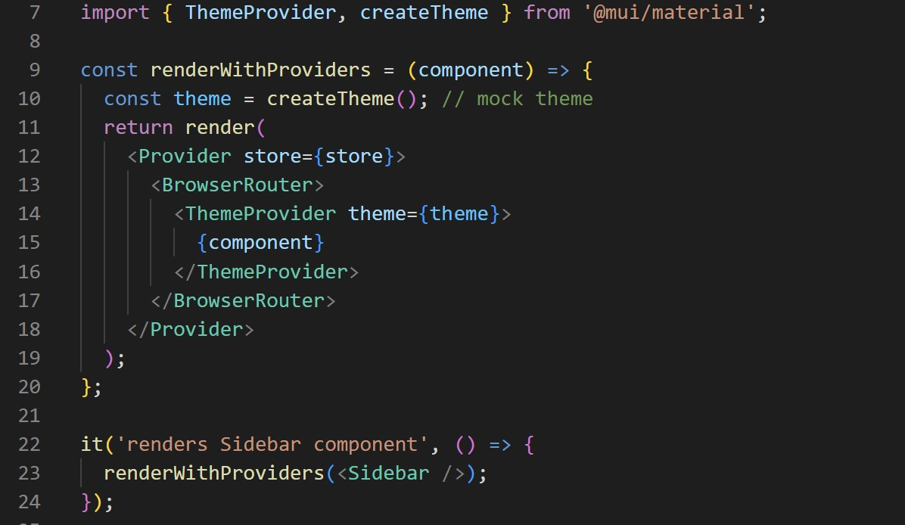
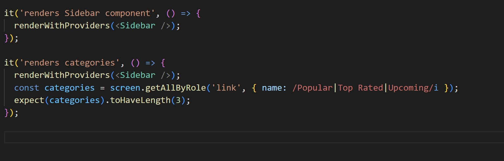
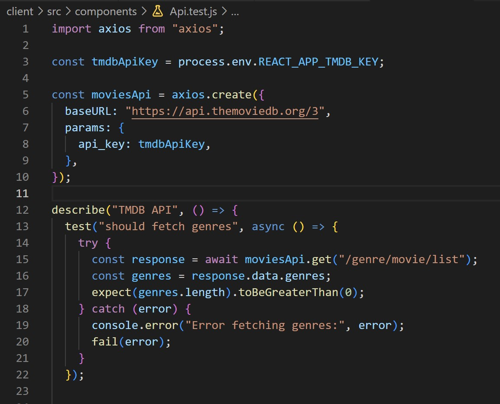
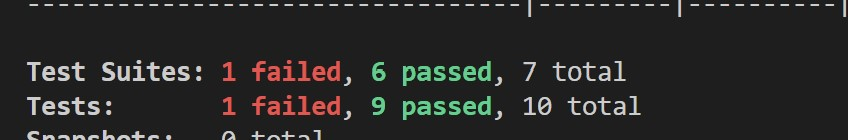

# Unit Testing

Overview : 

Since we are working on a React application , the focus of our Unit testing is primarily on testing React components  which involve rendering the component to be tested in an isolated environment and then checking it’s output or behaviour . 

 

Technologies for testing : 

React provide a rich environment of testing libraries and tools , but in our approach we focused on using  React Testing Library . 
In order to use this Library we had to solve dependencies issues to ensure that our testing environment is working as expected (isolated )  .

Testing Approach :

- We focused our testing on the crucial navigation Components such us Movie List and Side Bar . I focused on testing rendering these components , at first rendering the entire component wrapped in necessary providers and mocks (isolated environment) to avoid Redux store issues .

- To further test the correct behaviour of these components , we implemented Unit tests that check the correct rendering of elements inside the components to check if we get the expected output .  
We followed the approach of testing the correctness of presence of genres , categories , and also Movies by verifying the correct number of elements presence , and if they are rendered as expected .

- Further More we wanted to test the  functionality of the TMDB API used to ensure that any changes or updates to the API do not break expected behaviour of retrieving  all the data in our Application . 
We did test few API endpoints for correct calling of genres and categories per example to ensure the correct use of the TMDB api service .

Running Test Suites Output :

